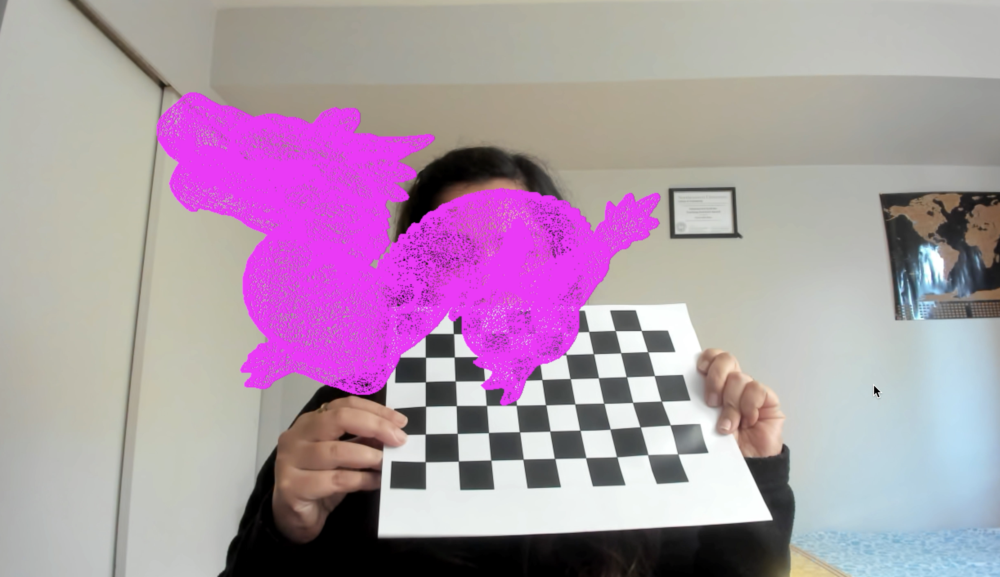

# Augmented-Reality

 

## To run the program- 
Need main.cpp, calibrate.cpp, calibrate.hpp, ObjectParser.cpp, ObjectParser.hpp, .obj file. 
Open them in an IDE and run the program after adding necessary opencv library files.

Command line argument:
obj_path :  path to wavefront obj file

Key Presses:
* 's' - save the current frame for calibration and calibrate using calibration images
* 'e' - show extracted corners for a calibration image
* 'd' - Detect the pattern and draw axes
* 'h' - Project chair on the target
* 'b' - Project cube on the target
* 't' - project table on the target
* 'p' - overlays an image on the ArUco markers
* 'r' - Detect and extract the matching ORB features between two images
* '3' - Project 3D obj file object
* 'a' - detect ArUco markers
* '7' - detect and display Harris corners
